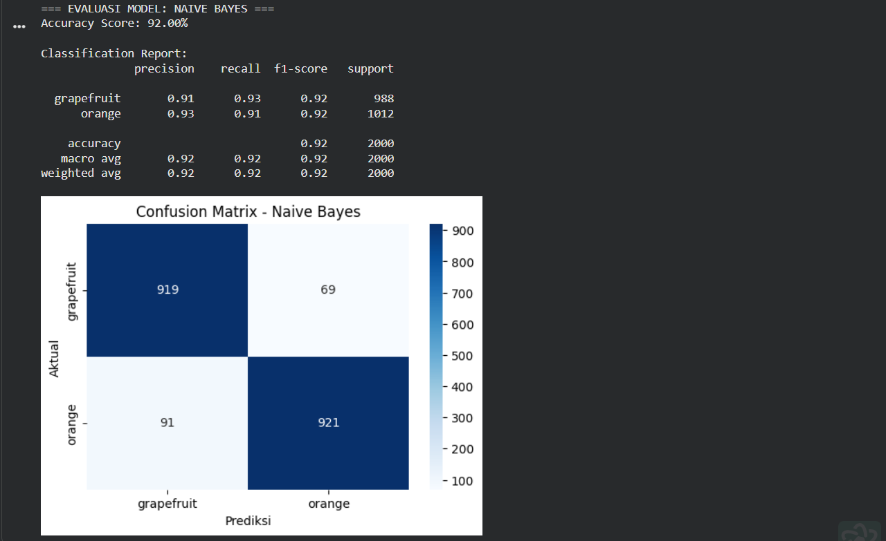

UTS Machine Learning: Citrus Fruit Classification (Oranges vs. Grapefruit)

 Introduction
This repository was created to fulfill the Midterm Exam (UTS) requirement for the Machine Learning course. The objective of this project is to develop a classification model capable of distinguishing between oranges and grapefruits based on numerical features

Dataset Background
The dataset used is from Kaggle: oranges vs. grapefruit. The main problem in this dataset is how a machine learning model can distinguish two visually similar types of fruit based solely on numerical features.
The features used include:
* Fruit diameter
* Fruit weight
* Color intensity (Red, Green, Blue)
This dataset is suitable for classification studies because it has clear labels and numerical features that can be analyzed directly.

1. Work Methodology (Step-by-Step)
   
-  Data Preprocessing (Model Foundation)
The preprocessing stage is crucial because data quality will significantly impact model performance.
 Label Encoding
The target variable `name` is converted to a numeric value:

* 0 = Orange
* 1 = Grapefruit
-  Feature Scaling (Standardization)
Performed using  StandardScaler  to ensure all features are on the same scale.
Goals:
* Avoid the dominance of certain features (e.g., weight being greater than diameter)
* Very important for distance-based models like SVM
-   Dataset Splitting
The data is divided into:
* 80% Training Data
* 20% Testing Data
This is done so the model can be tested on previously unseen data.

2. Algorithm Implementation & Architecture
  
I compared three different algorithmic approaches to see which best suited the citrus data pattern:
Decision Tree:  A decision tree-based algorithm that divides the data based on Information Gain. It is very intuitive in capturing non-linear relationships between physical features.
Naive Bayes (Gaussian NB): Uses a statistical probability approach. Although it assumes each feature is unrelated, this model is very fast and efficient for relatively simple datasets.
Support Vector Machine (SVM): An algorithm that finds the optimal hyperplane (separating line) with maximum margin. SVM is very robust in separating data with complex class boundaries.

3. Multi-Metric Evaluation
  
I don't rely solely on Accuracy, as accuracy can be deceptive if the data is imbalanced. Therefore, I use additional metrics:
Precision: The accuracy of positive predictions (avoiding mistakenly identifying oranges as grapes).
Recall: The model's ability to find all data of a given class (avoiding undetected oranges).
F1-Score: The harmonic mean between Precision and Recall as a metric of model performance balance.

Hasil Eksperimen (Screenshots)
The following is documentation of the program execution results showing the performance of each algorithm:
1.	Evaluation of Decision Tree Model
   
   
Classification output using Decision Tree. It shows the accuracy resulting from hierarchical data division.

2.	Evaluation of the Naive Bayes Model
   

 
Results from Naive Bayes. This model shows fairly stable performance even with a simple probability approach.

3.	Evaluation of the Support Vector Machine (SVM) Model
   
   
 SVM performance after data standardization. It typically shows very competitive results on numerical datasets like this.

4.	Overall Metrics Comparison
   
 
Summary tables and graphs comparing the performance of the three models head-to-head to determine the best model.

Conclusion

Among the evaluated models, the Decision Tree achieved the highest accuracy in this experiment. However, SVM also demonstrated strong performance, while Naive Bayes provided a fast and efficient baseline.
